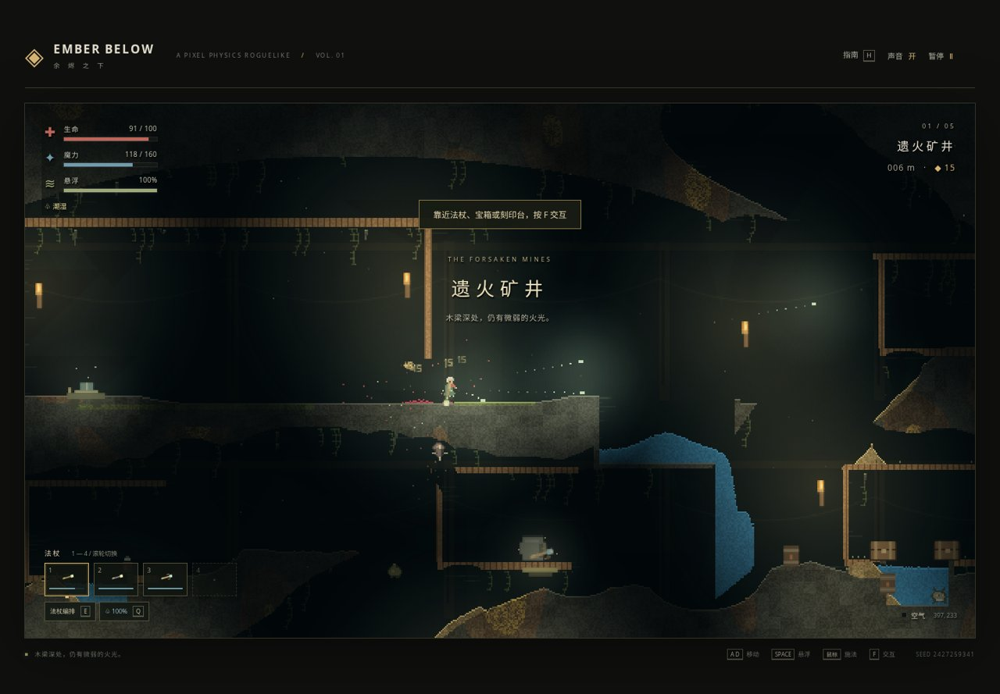
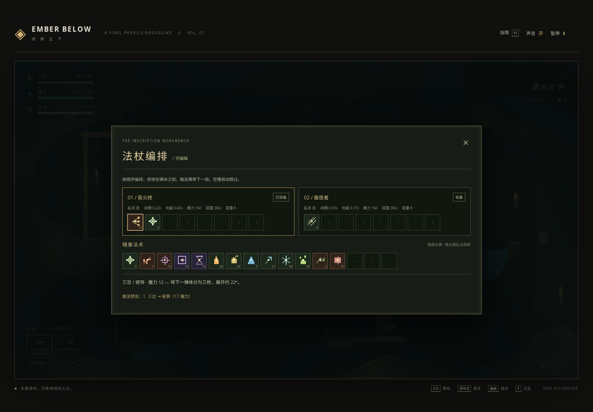

# 余烬之下 · EMBER BELOW

原创像素物理地牢：在黑暗中向下探索，用法杖组合改变地形，也承担火焰、毒雾和自己的爆炸带来的后果。

**原生 Canvas 2D + JavaScript + CSS。无后端、无构建、无 npm 依赖、无 CDN、无外部素材请求。** 游戏运行只需要同目录下的 `index.html`、`game.js`、`styles.css`。



## 运行

```bash
python3 -m http.server 4173 --bind 0.0.0.0
```

访问 **http://localhost:4173/**。也可以直接双击 `index.html` 离线运行；文件协议已在 Chromium 中验证。声音在首次点击后启用，可随时关闭。

## 操作

| 操作 | 桌面 |
|---|---|
| 左右移动 | `A / D` 或左右方向键 |
| 跳跃、按住悬浮 | `W / 空格 / ↑`；落地恢复燃料 |
| 瞄准、连续施法 | 鼠标移动、按住左键 |
| 换杖 | `1–4`、鼠标滚轮或点击法杖栏 |
| 拾取法杖、开箱、使用刻印台、取回余烬 | 靠近后按 `F` |
| 法杖编排 | `E`；离开刻印台时仅可查看、装备 |
| 泼水灭火 | `Q`；站在水中自动补满水瓶 |
| 暂停 / 指南 / 声音 | `Esc / H / M` |

**手机**：左侧按钮移动与悬浮；拖动右侧圆盘改变方向并持续施法，松手停止。另有拾取、换杖、法杖栏与水瓶按钮。支持多点触控、横竖屏切换；推荐横屏。切出窗口会清除输入并暂停。

## 第一次远行

1. 出生点左侧是**刻印台**，右侧台座有第三把法杖。向右探索，使用 `F` 拾取。
2. 初始 **苔火枝** 是战斗杖，**凿夜者** 是短程挖掘杖。普通弹体不能打穿坚岩，遇到木梁、地形阻挡时用第二把杖开路。
3. 在刻印台附近按 `E`，拖动背包或槽位中的法术；也可**点击来源，再点击目标**交换，适用于触屏和键盘 Enter。
4. 跟随裂隙向下；`REST ↓` 标记指向层间**烛息回廊**。进入后回血，可购买法术、改杖，并从三项天赋中选一项。
5. 五层路线为 **遗火矿井 → 黑烛煤脉 → 孢光菌庭 → 苍白霜窟 → 赤渊熔心**。击败熔心守卫后，靠近余烬按 `F` 获胜。
6. 死亡清空本局，新种子重开。不会保留本局金币、装备或天赋。

## 法杖不是一个技能按钮

每把杖有独立的魔力、回蓝速度、施法间隔、整组充能、容量、乱序属性及当前读取位置。法术按**从左到右**读取：一组施放后移动到下一组，牌组耗尽才等待充能；未装备的杖也会回蓝。

- **8 种弹体**：星屑、青棘、炽核、崩岩种、蚀光针、潮珠、霜棱、蚀露。
- **5 种修饰**：三岔、烬尾、寻踪、回响、重刻。
- **2 种触发**：碰撞印、时砂印。载体携带下一组法术，碰撞或计时后释放；预先支付载体与载荷的魔力，不重复扣蓝。
- **例一**：`三岔 → 烬尾 → 寻踪 → 星屑`，一次发射三枚带火焰轨迹的追踪弹。
- **例二**：`碰撞印 → 三岔 → 炽核`，先射出载体，碰撞后释放三枚爆裂核心。**不要贴脸试射**。
- **例三**：`时砂印 → 潮珠`，将水送到远处，灭火或让熔岩结石。

编辑界面显示各槽位耗蓝、描述和实际施法分组预览。没有弹体的组合不会开火；魔力不足时等待回复。最多携带四把杖，满位拾取会替换当前杖，旧杖留在地上。



## 会互相影响的系统

- **20 类材料（含空气）**：不同密度的液体通过交换像素分层，油在水上、血在水下；沙砾和雪下落，毒气、烟、蒸汽上浮。
- **真实反应**：火沿木、煤、苔和油蔓延，燃料耗尽后熄灭；水和血能灭火；熔岩遇水/血成为石头和蒸汽；酸蚀穿内部地形并释放毒气；热源融冰，霜棱冻结水。
- **破坏阈值**：软土、岩石、刻印石的耐久和硬度不同。钻掘/爆炸并非万能，酸可以腐蚀刻印石；世界外边界不可穿越。
- **暗处与光源**：分层岩纹、木纹、矿脉、根须和背景矿架；火把、晶体、发光法杖、飞行弹体、燃烧像素与岩浆各自提供局部径向光照。
- **5 类普通敌人**：冲锋的石牙兽、远程三连弹的灰烬哨兵、飞行的灯蛾、预警后自爆的爆囊兽、挖穿地形的掘骨蠕虫；另有熔心守卫。
- **风险与反馈**：潮湿、油污、燃烧、中毒、氧气；落石压伤与燃油桶连锁爆炸；震屏、闪白、弹道残光、血液、飘字及 WebAudio 合成音效。
- **探索收获**：金币、血瓶、宝箱、法杖台座、刻印台商店、六种本局天赋。

## 实际浏览器验证 · 2026-09-21

使用静态服务器 `4173` 和 **Chromium 153 headless**，不是只检查代码。

### 真实键鼠游玩（不改生命、不传送、不强制击杀）

| 远征 | 种子 | 游戏内时长 | 结果 |
|---|---:|---:|---|
| 移动、编排、拾杖、射击、挖掘探索 | 2427259341 | 78.55 秒 | 击败 **5** 只敌人，金币 **43**，深入 **159 m**，施法 284 次，结束测试时存活 |
| 承受敌人攻击以验证永久死亡 | 1469345192 | 6.45 秒 | 显示 **「死因 · 被击杀：石牙兽」**；点击重开后新种子、100 生命、0 金币/击杀、两把初始杖 |

合计约 **85 秒实际游戏时间**，不含菜单编辑、截图检查和下述专项测试。出生点可走、可跳、可悬浮、可施法，火把明暗及弹体光照已检查。无未捕获浏览器异常。

### 专项回归：48 / 48 通过

`tests/browser_smoke.py` 验证材料守恒和分层、蔓延与熄灭、熔岩反应、毒气上浮、酸蚀、粉末下落、破坏阈值、两类触发及预付魔力、真实鼠标拖放、编辑限制、拾杖、回廊/商店/天赋、各类死亡、重开、五层、守卫与胜利、手机触摸操作与布局、离线启动、无外部请求等。

**如实区分测试方式**：专项材料和死因测试使用隔离场景及低生命/坐标夹具；守卫流程使用增强生命和指定法杖以验证终局，不是从出生点正常通关的记录。手机为 Chromium 的 **390×844 / 844×390 触控仿真**，未声称已在实体手机或 Safari/Firefox 验收。

- [结构化测试记录](tests/validation-2026-09-21.json)
- [实际死亡截图](tests/evidence/death.jpg) · [手机截图](tests/evidence/mobile.jpg)
- [研究依据与参考文件质量说明](report-source.md) · [交付说明](DONE.md)

### 可选开发测试

游戏本身不需要以下工具。复跑测试才需要 Python Playwright 与 Chromium：

```bash
# 另开终端，保持上面的静态服务器运行
python3 -m venv .venv
.venv/bin/pip install playwright
.venv/bin/playwright install chromium
.venv/bin/python tests/browser_smoke.py
# 或指定已有浏览器：CHROME_BINARY=/path/to/chromium .venv/bin/python tests/browser_smoke.py
```

脚本默认访问 `http://127.0.0.1:4173`，可通过 `GAME_URL` 修改。夹具仅由 `?test=1` 显式开启；正常页面没有测试接口。新截图/日志写入已忽略的 `test-results/`，仓库仅保留小型验收记录及四张压缩证据图。

## 实现边界

这是围绕本次任务重写的可玩原创实现，并非原作完整移植。模拟以 60 Hz 固定步进更新角色、30 Hz 更新视口及边缘活动区的材料；远处材料暂缓模拟。爆炸使用距离衰减的硬度近似，不是原作逐射线能量模型。光照为径向遮罩，没有几何遮挡投影。落石/桶是简化物理对象，不是通用刚体解算器；三岔复制下一弹体，不实现原作全部抽牌回绕规则。未知法术组合、极端长局和实体移动设备性能仍需更多测试。
