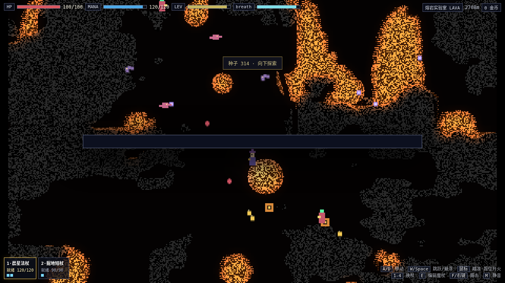

# PIXEL ALCHEMIST

一个零后端、纯前端的 Noita 风格像素物理地牢。项目只有 `index.html` 和 `game.js`（样式内联），双击或通过任意静态文件服务器打开即可。每个像素都参与模拟：固体、粉末、按密度分层的液体、气体、会蔓延也会熄灭的火焰，以及一整套炼金反应。



## 运行

```bash
python3 -m http.server 4173
```

然后访问 `http://localhost:4173/`。不需要安装依赖，也不需要联网。也可以直接双击 `index.html` 用浏览器打开。

## 操作

| 操作 | 桌面 | 手机 |
|---|---|---|
| 移动 | `A` / `D` 或 `←` `→` | ◀ ▶ 按钮 |
| 跳跃 / 悬浮飞行 | `W` / `↑` / `Space`（空中长按可悬浮，消耗 LEV） | ▲ 按钮 |
| 瞄准 / 开火 | 移动鼠标瞄准，按住左键连发 | ✦ 按钮（朝准星或最近敌人） |
| 切换魔杖 | `1`–`4` | 「换杖」按钮 |
| 编辑魔杖 | `E`（在圣山内或拥有「魔杖工匠」） | 「改杖」按钮 |
| 踢击（近战/击退） | `F` 或鼠标右键 | — |
| 静音 | `M` | — |

## 已实现（对照 Noita 核心系统）

- **像素物理 / 材料**：36 种材料，分 固体 / 粉末 / 液体 / 气体 / 火焰 五类。液体按**密度分层**（油浮于水、血与强酸沉底）；**强酸腐蚀**一切可腐蚀物；**火焰沿可燃物蔓延并会熄灭**（入水/寿命耗尽即灭）；**熔岩遇水成石 + 蒸汽**、熔岩融砂成玻璃、融雪成水；**毒气 / 蒸汽 / 烟雾上浮**；毒液飘成毒气；血遇毒变软泥。每种材料都有**颗粒质感贴图**（随像素移动的噪声纹理），不是纯色块。
- **黑暗与光照**：洞穴近乎全黑，只有**火焰、熔岩、荧光石、魔法液、发光法术、火把**等以**径向渐变光晕**照亮周围（暖色火光 / 冷色魔法光），这是氛围的灵魂。
- **法杖组装（核心）**：可在地图上的**魔杖 pedestal** 捡杖；在**圣山编辑台**（或「魔杖工匠」祝福）把法术拖进槽位。含 **14 种弹体法术、14 种修饰、2 种触发（触发 / 定时）**，以及多重施法、连发、散射、速度、魔力、充能等魔杖属性。可组合出「散射 + 烈焰轨迹 + 追踪 + 触发爆裂」这类连锁；触发/定时弹命中或到期会释放其载荷法术。
- **探索与死亡**：五层纵向生物群系 **矿坑 → 煤坑 → 真菌洞穴 → 雪渊 → 熔岩实验室**，层间以**圣山**（安全区：编辑台、宝箱、法术刷新、三选一祝福祭坛）相隔；越深越危险。金币 / 生命 / 法术 / 宝箱 / 魔杖 pedestal。**死亡必须写明死因**（烧死 / 溺死 / 压死 / 毒死 / 被强酸腐蚀 / 被爆炸撕碎 / 被敌人近战或法术击杀）后整局重开。
- **打击感**：屏幕震动、命中白闪、飘字、粒子爆裂、血液/火花，WebAudio 实时合成音效（无需音频文件）。
- **敌人**：7 种，行为各异——近战冲锋（幽影）、远程弹幕（毒术师）、飞行绕袭（夜蜓）、近身自爆（自爆虫）、潜地穿刺（潜地者）、跳跃喷吐（软泥），以及关底 **终焉之眼**（多段弹幕、随血量加速）。
- **双端**：桌面键鼠 + 手机触屏（虚拟按键）均可玩。

## 研究依据与边界

研究摘要和来源见 `report-source.md`，权威设计蓝本在 `refs/wiki/`（材料、炼金反应表、法杖、法术、修饰、生物群系、圣山、天赋、状态效果、敌人、伤害类型）。实现使用**原创代码、原创像素绘制与原创命名**，仅复刻公开描述的系统关系；未复制 Noita 的原始资源、音频或源代码。原作包含数百种法术/材料/敌人与精确内部数值，本项目把最能决定手感的系统做成了可玩的浏览器版本，数值为近似。

## 实测记录

已用无头 Chrome 实际驱动 `update()`/`render()` 完整跑通（详见 `DONE.md`）：

- 出生点可**行走、跳跃、施法**；光照正常（火焰把像素亮度从 0 提到 ~100）；可**打死敌人**；**死亡有死因提示**。
- 五种死因均实测触发：烧死 / 毒死 / 溺死 / 压死 / 被近战击杀。
- 连贯试玩约 43 秒（2600 帧）：击杀 3 只、拾取 25 金、施法 183 次、下潜 209m。
- 软件渲染下约 60–120 FPS（真实浏览器更流畅）；穿越全部群系与圣山、至关底无崩溃。
